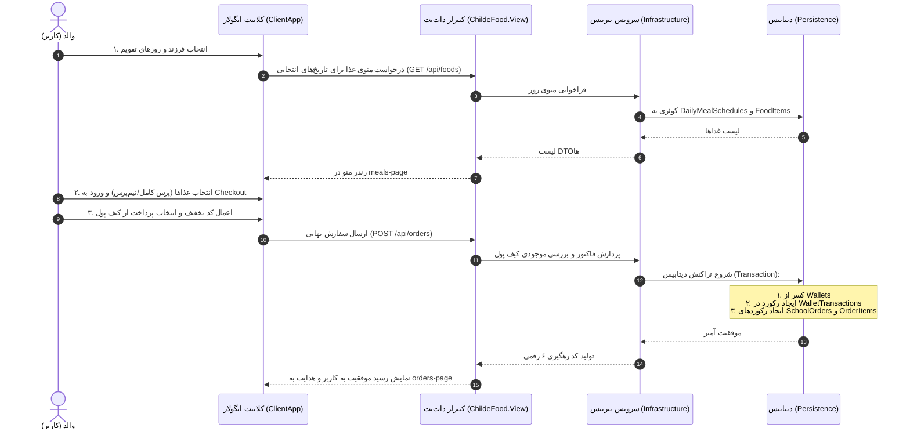

# 🍱 سامانه جامع رزرو ناهار گرم مدارس (ChildeFood)

سلام هم‌تیمی! این داکیومنت راهنمای جامع فنی و بیزنسی پروژه **ChildeFood** است. این سند با بررسی خط به خط تمام کامپوننت‌ها، استورها، مدل‌ها و تمپلیت‌های لایه **View** (پوشه `src/ChildeFood.View/ClientApp`) آماده شده تا قبل از استارت طراحی دیتابیس، دیاگرام‌های ERD و انتیتی‌های لایه `Domain`، دقیقاً بدونی فرانت‌اِند چه انتظاراتی از بک‌اند داره و چه داده‌ها، وضعیت‌ها و فیلدهایی باید توی جداول ذخیره بشن.

---

## ۱. پروژه ChildeFood اصلاً چیه و چه مشکلی رو حل می‌کنه؟

**چایلدفود (ChildeFood)** یک وب‌اپلیکیشن پیش‌رونده (PWA) موبایل‌محور با تمرکز ویژه روی تجربه کاربری والدین دانش‌آموزان است. در حالت سنتی، سفارش غذای مدارس با فرم‌های دستی، صف بوفه، عدم اطلاع دقیق والدین از برنامه غذایی و مشکلات پول نقد همراهه.

در چایلدفود:
1. **والد (Parent)** وارد حساب کاربریش میشه و فرزند یا فرزندان محصلش رو می‌بینه.
2. فرزند مورد نظر رو انتخاب می‌کنه (مثلاً علی یا آوا).
3. روزهای کاری ماه یا دو هفته آینده (مثلاً ۱۰ روز مدرسه) رو از روی تقویم انتخاب می‌کنه.
4. برای هر روز، منوی ناهار گرم متناسب با همون روز رو ورق می‌زنه، نوع پرس (کامل یا نیم‌پرس) رو مشخص می‌کنه و ثبت می‌کنه.
5. در صفحه بررسی فاکتور نهایی (Checkout)، کد تخفیف می‌زنه، شیوه پرداخت (کیف پول یا درگاه بانکی) رو انتخاب می‌کنه و سفارش نهایی میشه.
6. سفارش مستقیماً به بوفه/کیترینگ مدرسه ارسال میشه و والد لحظه‌به‌لحظه وضعیت آماده‌سازی، ارسال و تحویل ناهار به دست فرزندش رو پیگیری می‌کنه.

---

## ۲. معماری فنی پروژه (Tech Stack & Architecture)

این پروژه از ترکیب قدرتمند **.NET 10 Clean Architecture** در بک‌اند و **Angular 21 Standalone + Tailwind CSS v4** در فرانت‌اِند بهره می‌برد:

```text
ChildeFood (Solution: ChildeFood.slnx)
│
├── src/
│   ├── ChildeFood.Domain/         # موجودیت‌های پایه، اینام‌ها و قواعد دامنه (بدون وابستگی)
│   ├── ChildeFood.Application/    # اینترفیس‌ها، DTOها، لاجیک یوزکیس‌ها و نگاشت‌ها
│   ├── ChildeFood.Infrastructure/ # پیاده‌سازی سرویس‌ها، ارتباطات درگاه و لاجیک سنگین بیزینس
│   ├── ChildeFood.Persistence/    # کانتکست EF Core، کانفیگ جداول دیتابیس و مایگریشن‌ها
│   └── ChildeFood.View/           # هاست Web API، کنترلرهای باریک (Dumb Controllers)
│       └── ClientApp/             # اپلیکیشن کلاینت انگولار (Angular SSR + Tailwind PWA)
```

---

## ۳. قابلیت‌ها و اجزای لایه View (موبایل و کامپوننت‌ها)

کل لایه ویو بر اساس یک فلو ۵ مرحله‌ای شفاف و منظم طراحی شده است:
- **مرحله ۱:** انتخاب فرزند (Child Selector)
- **مرحله ۲:** انتخاب روزهای تقویم (Calendar Days Selector)
- **مرحله ۳:** انتخاب غذای ناهار هر روز و نوع پرس (Meals Selection Strip)
- **مرحله ۴:** بازبینی فاکتور، کد تخفیف و پرداخت (Checkout Review & Payment)
- **مرحله ۵:** رهگیری زنده و مشاهده فاکتور نهایی (Live Order Tracking)

### فهرست صفحات اصلی (Pages):

| نام کامپوننت | شناسه مسیر / تب | وظیفه اصلی در رابط کاربری |
| :--- | :--- | :--- |
| `home-page` | `home` | داشبورد اصلی والد: خلاصه وضعیت فرزند فعال، کارت موجودی کیف پول، سفارش‌های ناهار امروز، پیشنهاد سرآشپز و دسترسی‌های سریع. |
| `calendar-page` | `calendar` | انتخاب روزهای تقویم برای سفارش (تقویم شمسی ماهانه، تمایز روزهای گذشته، روزهای تعطیل و انتخاب چندروزه). |
| `meals-page` | `meals` | منوی ناهار هر روز: نوار افقی روزهای رزرو، گرید غذاها، انتخاب پرس کامل/نیم‌پرس، فیلتر کتگوری و نوار جزیره‌ای شناور. |
| `checkout-page` | `checkout` | پیش‌فاکتور شفاف: مشخصات دانش‌آموز، لیست ریزغذاها، اعمال کد تخفیف، انتخاب درگاه شتاب/کیف پول و دکمه پرداخت نهایی. |
| `orders-page` | `orders` | لیست کامل تاریخچه و سفارش‌های در حال تحویل مدارس با امکان فیلتر تب‌ها (`همه`، `فعال`، `تحویل شده`) و مودال پیگیری زنده. |
| `wallet-page` | `wallet` | صفحه جامع کارت اعتباری: موجودی لایو، شارژ سریع با مبالغ پیشنهادی، تاریخچه تراکنش‌ها با وضعیت تراکنش و تفکیک خرید/واریز. |
| `children-page` | `children` | مدیریت پرونده دانش‌آموزان: لیست فرزندان، افزودن فرزند جدید با مشخصات مدرسه، پایه و یادداشت‌های سلامت/آلرژی. |
| `profile-page` | `profile` | پروفایل سرپرست خانواده: مشخصات فردی، کدملی، آدرس منزل، تنظیمات نوتیفیکیشن‌ها و پیامک وضعیت ناهار. |

---

## ۴. راهنمای طراحی دیتابیس (بر اساس نیازمندی‌های قطعی View)

برای طراحی دیتابیس (SQL Server یا PostgreSQL)، مدل‌ها و فیلدهای زیر بر اساس دیتای لایو مورد نیاز View استخراج شده است:

### ۱) جدول سرپرست / والدین (`Parents` یا `Users`)
اطلاعات والدینی که وارد برنامه شده و برای فرزندانشان سفارش ثبت می‌کنند:

| نام فیلد پیشنهادی | نوع داده | وضعیت | توضیح و کاربرد در View |
| :--- | :--- | :--- | :--- |
| `Id` | `Guid` / `bigint` | PK | شناسه یکتای والد |
| `FullName` | `nvarchar(150)` | Not Null | نام و نام خانوادگی (مثال: `سارا احمدی` یا `محمد احمدی`) |
| `PhoneNumber` | `varchar(15)` | Not Null, Unique | شماره موبایل والد جهت ارسال پیامک و لاگین (مثال: `09123456789`) |
| `NationalId` | `varchar(10)` | Nullable | کد ملی والد (مثال: `0018472910`) |
| `Email` | `varchar(150)` | Nullable | ایمیل سرپرست |
| `RoleTitle` | `nvarchar(50)` | Not Null | نقش سرپرستی (مثال: `مادر (سرپرست خانواده)`، `پدر`) |
| `Address` | `nvarchar(500)` | Nullable | آدرس پیش‌فرض منزل یا توضیحات تحویل |
| `DeliveryNotes` | `nvarchar(500)` | Nullable | یادداشت‌های تکمیلی تحویل (مثال: `تحویل به بوفه مرکزی مدرسه`) |
| `AvatarUrl` | `nvarchar(500)` | Nullable | آدرس فایل تصویر یا آیکون نمایه والد |
| `IsSmsNotificationActive` | `bit` | Not Null, Def: 1 | وضعیت ارسال پیامک هنگام آماده‌سازی و تحویل ناهار |
| `CreatedAt` | `datetimeoffset` | Not Null | تاریخ ثبت‌نام |

---

### ۲) جدول فرزندان / دانش‌آموزان (`Children` یا `Students`)
هر والد می‌تواند یک یا چند فرزند متصل به مدارس مختلف داشته باشد (رابطه ۱ به N با والد):

| نام فیلد پیشنهادی | نوع داده | وضعیت | توضیح و کاربرد در View |
| :--- | :--- | :--- | :--- |
| `Id` | `Guid` / `bigint` | PK | شناسه فرزند (در فرانت: `child-1`) |
| `ParentId` | `Guid` / `bigint` | FK, Not Null | کلید خارجی به جدول والدین |
| `SchoolId` | `Guid` / `bigint` | FK, Nullable | کلید خارجی به جدول مدارس (در صورت نرمال‌سازی) |
| `FullName` | `nvarchar(150)` | Not Null | نام فرزند (مثال: `علی احمدی`، `آوا احمدی`) |
| `SchoolName` | `nvarchar(200)` | Not Null | نام مدرسه یا مرکز آموزشی (مثال: `دبستان دخترانه سرو`) |
| `Grade` | `nvarchar(100)` | Not Null | پایه تحصیلی و کلاس (مثال: `کلاس پنجم`، `کلاس ۲۰۴`) |
| `Age` | `int` | Not Null | سن دانش‌آموز |
| `AvatarUrl` | `nvarchar(500)` | Not Null | تصویر یا آواتار SVG (مثال: `/assets/avatars/ali.svg`) |
| `DietaryNotes` | `nvarchar(500)` | Nullable | یادداشت‌های رژیم، منع مصرف یا آلرژی (مثال: `بدون بادام زمینی`، `کم‌نمک`) |
| `FavoriteFood` | `nvarchar(150)` | Nullable | غذای مورد علاقه فرزند جهت پیشنهاددهی هوشمند |
| `IsActive` | `bit` | Not Null, Def: 1 | فعال/غیرفعال بودن پرونده دانش‌آموز |

---

### ۳) جدول مدارس و مراکز آموزشی (`Schools`)
مدارسی که با سامانه کیترینگ قرارداد دارند:

| نام فیلد پیشنهادی | نوع داده | وضعیت | توضیح و کاربرد در View |
| :--- | :--- | :--- | :--- |
| `Id` | `Guid` / `bigint` | PK | شناسه مدرسه |
| `Name` | `nvarchar(200)` | Not Null | نام مدرسه (مثال: `مدرسه نمونه`، `دبستان سرو`) |
| `BranchCode` | `varchar(50)` | Nullable | کد یا منطقه آموزشی |
| `Address` | `nvarchar(500)` | Nullable | آدرس فیزیکی مدرسه |
| `DefaultLunchTime` | `time` | Not Null | ساعت سرو ناهار گرم (مثال: `12:30:00`) |
| `ContactPerson` | `nvarchar(100)` | Nullable | نام مسئول بوفه یا ناظر مدرسه |

---

### ۴) جدول غذاها و اقلام بوفه (`FoodItems` یا `Meals`)
آیتم‌های منوی قابل سفارش با قابلیت انتخاب سایز پرس و اطلاعات تغذیه‌ای:

| نام فیلد پیشنهادی | نوع داده | وضعیت | توضیح و کاربرد در View |
| :--- | :--- | :--- | :--- |
| `Id` | `Guid` / `bigint` | PK | شناسه غذا (مثال: `joojeh-kabab-12`) |
| `Title` | `nvarchar(150)` | Not Null | عنوان غذا (مثال: `چلو جوجه کباب زعفرانی`) |
| `Subtitle` | `nvarchar(300)` | Not Null | توضیحات کوتاه، مخلفات و دورچین غذا |
| `Price` | `decimal(18,0)` | Not Null | قیمت پایه (پرس کامل) به تومان (مثال: `89000`) |
| `HalfPortionPrice` | `decimal(18,0)` | Nullable | قیمت نیم‌پرس (یا محاسبه درصدی مثلاً ۶۵٪ قیمت پایه) |
| `Category` | `int` / `varchar(30)` | Not Null | دسته‌بندی: `Main` (اصلی)، `Drinks` (نوشیدنی)، `Dessert` (دسر)، `Snack` (میان‌وعده) |
| `BadgeText` | `nvarchar(50)` | Nullable | برچسب مارکتینگ (مثال: `محبوب 🔥`، `غذای روز`، `۲۵٪-`، `ویژه سرآشپز`) |
| `BadgeType` | `varchar(30)` | Nullable | استایل بج: `popular`, `chef`, `discount`, `grilled`, `spicy`, `special` |
| `Emoji` | `nvarchar(10)` | Not Null | آیکون اموجی برای نمایش سریع (مثال: `🍗`، `🍕`، `🍔`) |
| `ImageUrl` | `nvarchar(500)` | Nullable | عکس باکیفیت برای کارت غذا |
| `Calories` | `int` | Nullable | کالری غذا (جهت محاسبه جدول ارزش غذایی) |
| `Protein` | `int` | Nullable | میزان پروتئین (گرم) |
| `Carbs` | `int` | Nullable | میزان کربوهیدرات (گرم) |
| `Fat` | `int` | Nullable | میزان چربی (گرم) |
| `Ingredients` | `nvarchar(max)` | Nullable | لیست مواد اولیه (JSON یا جدول واسط) |
| `Allergens` | `nvarchar(max)` | Nullable | مواد حساسیت‌زا (مانند گلوتن، لبنیات، بادام) |
| `IsAvailable` | `bit` | Not Null, Def: 1 | وضعیت موجودی در بوفه |

---

### ۵) جدول تقویم غذایی روزانه (`DailyMealSchedules`)
در چایلدفود، هر روز تقویم منوی ناهار مشخصی دارد. غذاها می‌توانند در روزهای متفاوتی عرضه شوند:

| نام فیلد پیشنهادی | نوع داده | وضعیت | توضیح و کاربرد در View |
| :--- | :--- | :--- | :--- |
| `Id` | `bigint` | PK | شناسه رکورد تقویم |
| `Date` | `date` | Not Null | تاریخ عرضه ناهار (شمسی یا میلادی معادل) |
| `FoodItemId` | `Guid` / `bigint` | FK, Not Null | غذای ارائه شده در این تاریخ |
| `SchoolId` | `Guid` / `bigint` | FK, Nullable | در صورت اختصاصی بودن منوی یک مدرسه |
| `MaxCapacity` | `int` | Nullable | سقف سفارش قابل پذیرش توسط آشپزخانه |
| `IsHoliday` | `bit` | Not Null, Def: 0 | آیا این روز تعطیل است؟ |

---

### ۶) جدول سفارش‌های مدرسه (`SchoolOrders`)
ثبت سفارش نهایی توسط والدین برای یک یا چند روز مشخص:

| نام فیلد پیشنهادی | نوع داده | وضعیت | توضیح و کاربرد در View |
| :--- | :--- | :--- | :--- |
| `Id` | `Guid` / `bigint` | PK | شناسه یکتای سفارش |
| `OrderCode` | `varchar(20)` | Not Null, Unique | شماره سفارش قابل نمایش (مثال: `ORD-1042`) |
| `ParentId` | `Guid` / `bigint` | FK, Not Null | والد ثبت‌کننده سفارش |
| `ChildId` | `Guid` / `bigint` | FK, Not Null | فرزند مورد نظر که ناهار برای اوست |
| `ServingDate` | `date` | Not Null | تاریخی که غذا باید در مدرسه سرو شود |
| `DeliveryTime` | `nvarchar(50)` | Not Null | ساعت تحویل (مثال: `ساعت ۱۲:۳۰`) |
| `TotalRawPrice` | `decimal(18,0)` | Not Null | جمع کل قبل از تخفیف |
| `DiscountAmount` | `decimal(18,0)` | Not Null, Def: 0 | مبلغ تخفیف کسر شده |
| `FinalPayablePrice` | `decimal(18,0)` | Not Null | مبلغ نهایی پرداختی به تومان |
| `PaymentMethod` | `int` / `varchar(20)` | Not Null | شیوه پرداخت: `Wallet` (کیف پول) یا `Online` (درگاه شتاب) |
| `Status` | `int` / `varchar(30)` | Not Null | وضعیت سفارش: `delivering` (آماده‌سازی)، `delivered` (تحویل شده)، `cancelled` (لغو شده) |
| `TrackingCode` | `varchar(20)` | Not Null | کد رهگیری ۶ رقمی شتاب یا سیستم (مثال: `۹۸۴۷۱۲`) |
| `CouponCode` | `varchar(50)` | Nullable | کد تخفیف اعمال‌شده (مثال: `MADRESEH`) |
| `CreatedAt` | `datetimeoffset` | Not Null | تاریخ و ساعت ثبت |

---

### ۷) جدول اقلام سفارش (`OrderItems`)
جزئیات ریزغذاهای سفارش داده شده برای هر روز:

| نام فیلد پیشنهادی | نوع داده | وضعیت | توضیح و کاربرد در View |
| :--- | :--- | :--- | :--- |
| `Id` | `bigint` | PK | شناسه آیتم |
| `OrderId` | `Guid` / `bigint` | FK, Not Null | کلید خارجی به جدول سفارش اصلی |
| `FoodItemId` | `Guid` / `bigint` | FK, Not Null | غذای انتخاب شده |
| `FoodTitle` | `nvarchar(150)` | Not Null | عنوان غذا در لحظه ثبت (اسنپ‌شات) |
| `Portion` | `nvarchar(20)` | Not Null | نوع پرس: `کامل` یا `نیم پرس` |
| `Quantity` | `int` | Not Null, Def: 1 | تعداد پرس سفارش داده شده |
| `UnitPrice` | `decimal(18,0)` | Not Null | قیمت واحد در زمان سفارش |
| `TotalPrice` | `decimal(18,0)` | Not Null | قیمت نهایی سطر (`UnitPrice * Quantity`) |

---

### ۸) جدول کیف پول و تراکنش‌ها (`Wallets` و `WalletTransactions`)
مدیریت اعتبار والدین، شارژ آنلاین و کسر خودکار هزینه سفارشات:

**جدول کیف پول (`Wallets`):**
- `Id`: کلید اصلی
- `ParentId`: کلید خارجی والد (یکتا - هر والد یک کیف پول دارد)
- `Balance`: موجودی ریالی/تومانی فعلی (مثال: `250000`)
- `VirtualCardNumber`: شماره کارت مجازی جهت نمایش گرافیکی (مثال: `IR-5820-4910-3820`)
- `LastUpdated`: تاریخ آخرین تغییر موجودی

**جدول تراکنش‌ها (`WalletTransactions`):**
- `Id`: شناسه تراکنش (در فرانت: `TX-94821`)
- `WalletId`: کلید خارجی کیف پول
- `ParentId`: کلید خارجی والد
- `Amount`: مبلغ تراکنش به تومان
- `Type`: نوع تراکنش (`deposit` شارژ/واریز، `purchase` پرداخت سفارش غذا، `refund` برگشت وجه)
- `Title`: عنوان تراکنش (مثال: `شارژ آنلاین کیف پول`، `رزرو ناهار علی`)
- `Subtitle`: توضیحات تکمیلی (مثال: `درگاه شاپرک • بانک سامان`)
- `ChildId`: در صورت ارتباط با یک فرزند خاص
- `TrackingCode`: کد پیگیری تراکنش
- `Status`: وضعیت (`successful` موفق، `pending` در حال پردازش، `failed` ناموفق)
- `CreatedAt`: زمان ثبت تراکنش

---

### ۹) جدول کدهای تخفیف (`Coupons` / `Discounts`)
سیستم پروموشن برای تخفیف‌های مدارس یا مناسبت‌ها:

- `Id`: کلید اصلی
- `Code`: کد تخفیف (مثال: `MADRESEH`)
- `DiscountType`: درصدی (`Percentage`) یا مبلغ ثابت (`FixedAmount`)
- `DiscountValue`: مقدار درصد یا مبلغ
- `MaxDiscountAmount`: سقف تخفیف
- `MinOrderAmount`: حداقل مبلغ سفارش برای فعال‌سازی
- `ExpiryDate`: تاریخ انقضا
- `UsageLimit`: حداکثر تعداد استفاده کل
- `UsedCount`: تعداد دفعات مصرف شده تا الان
- `IsActive`: وضعیت فعال بودن

---

## ۵. جریان داده‌ها و فرآیندهای کلیدی (Data Flows)



---

## ۶. نحوه اجرای پروژه به صورت محلی (Local Development)

پروژه به صورت یکپارچه با قابلیت SPA Proxy دات‌نت کانفیگ شده است:

### روش ۱: اجرای همزمان دات‌نت و انگولار (پیشنهادی)
```powershell
# از روت اصلی پروژه:
dotnet run --project src/ChildeFood.View/ChildeFood.View.csproj
```
دات‌نت به طور خودکار اسکریپت `npm start` در پوشه `ClientApp` را اجرا کرده و روی پورت‌های `5109` (بک‌اند) و `4200` (فرانت‌اِند) بالا می‌آید.

### روش ۲: توسعه مجزای کلاینت انگولار (Vite Fast HMR)
```powershell
cd src/ChildeFood.View/ClientApp
npm install
npm start
```
سرور دولوپمنت زنده انگولار روی آدرس `http://localhost:4200` در دسترس خواهد بود.

### روش ۳: اجرای تست‌های یونیت
```powershell
cd src/ChildeFood.View/ClientApp
npm test -- --watch=false
```
تمام ۹۵ تست کامپوننت‌ها به صورت خودکار اجرا و تایید می‌شوند.

---

> [!TIP]
> **نکته مهم برای همکار بک‌اند / دیتابیس کار:**
> تمام موجودیت‌های بالا رو می‌تونی با انتیتی‌های استاندارد C# در لایه `ChildeFood.Domain/Entities` و مپینگ Fluent API در لایه `ChildeFood.Persistence/Configurations` پیاده‌سازی کنی. تمام نیازهای نمایشی فرانت در این جداول پوشش داده شده است.
